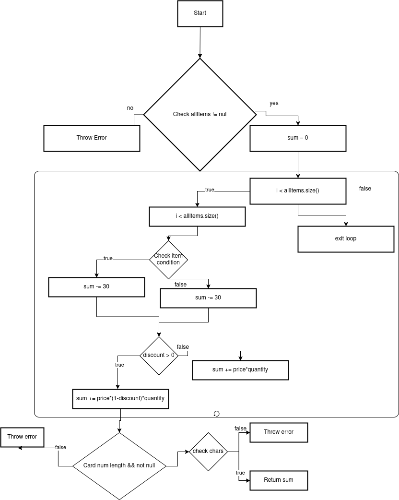

Omer , Tairi , 231539

3) M = E - N + 2P

From the code:

    if (cardNumber == null || cardNumber.length() != 10) → 1

    for (Item item : allItems) → 1 (loop counts as a branch)

    if (item.getName() == null || item.getPrice() < 0 || item.getQuantity() <= 0) → 1

    if (item.getPrice() > 300 || item.getDiscount() > 0 || item.getQuantity() > 10) → 1

Total = 6 decisions → Cyclomatic Complexity = 4 + 1 = 5

4) 6 test cases

5) So we need 4 test cases to fully test all combinations.

